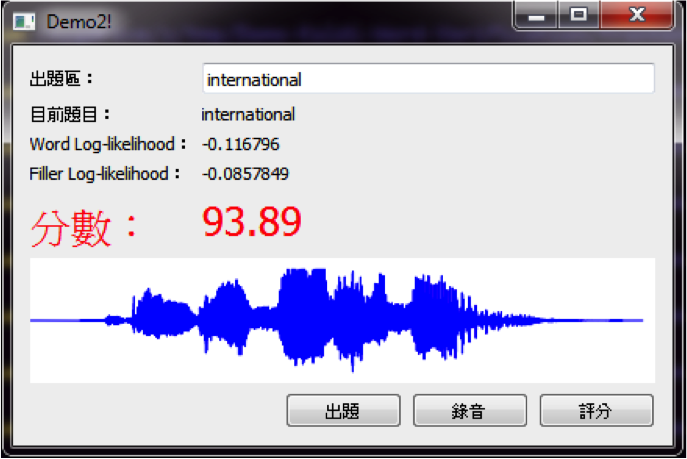

Demo-Kaldi-Word-Verification
============================

A demo on automatic speech word selection and verification using Kaldi, with frontends.

Screenshot
-----

Dependencies
-----
 * A basic POSIX environment(cygwin is ok), wget, zsh, sed and xz
 * Kaldi : http://kaldi.sourceforge.net/
 * Python, PySide and Matplotlib (only for PySide GUI front-end)

Install
-----
 1. Install all dependencies. Note that we need a full source tree of Kaldi, not only its binaries and libraries. You can find an example script of installing Kaldi under cygwin [here](https://github.com/cybeliak/KaldiFace/blob/master/doc/compile_cygwin.sh).
 2. copy local.zsh.template to local.zsh, and point variables in local.zsh to the actual path in your environment.
 3. The PySide front-end is not tested under cygwin version of Python 3, you may need to install native Python under Windows (along with PySide, of course) and point the `PYTHON_EXECUTABLE` variable to the actual installation path of native Python.
 4. Run 10.prepare/download\_lexicon.zsh to get the CMU dictionary.

Notes
-----

### Regarding model training

 * The training of acoustic model used by this project involving Aurora-4 corpus and WSJ0 corpus, which are quite expensive if you just want to try it out. In this repository, there is already a trained model under model/, so you don't have to actually run the training script if you don't own the corpora.

Caveats and Known Bugs
-----
 * We directly use the Makefile from Kaldi. If there are bugs, things in this project will also be affected.

Author and Acknowledgements
-----
Yu-chen Kao (cybeliak) : cybeliak [the mysterious symbol] mail asteraceae org

License
-----
This project is licensed under the Academic Free License, Version 3.0.
See LICENSE for details.
